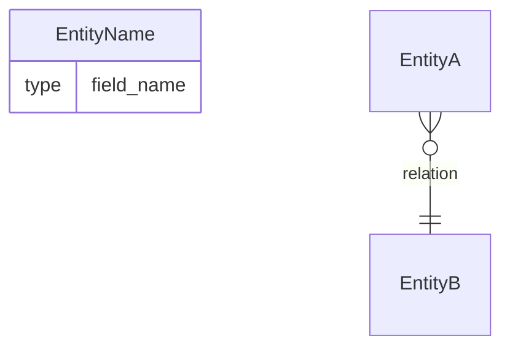

# ERD 생성 스킬

Django 프로젝트 내 모든 앱의 `models.py` 파일을 분석하여 Mermaid erDiagram 형식의 ERD를 `docs/erd.md`에 생성한다.

## 실행 절차

1. `.venv` 디렉토리를 제외하고 프로젝트 내 모든 `models.py` 파일을 탐색한다.
2. 각 모델의 필드, 타입, 관계(ForeignKey, OneToOneField, ManyToManyField)를 파악한다.
3. Mermaid `erDiagram` 문법으로 ERD를 작성한다.
   - 필드명과 타입을 엔티티 내부에 표기한다.
   - ForeignKey → `}o--||` (many-to-one)
   - OneToOneField → `||--||` (one-to-one)
   - ManyToManyField → `}o--o{` (many-to-many)
4. 결과를 `docs/erd.md`에 덮어쓴다.

## 출력 형식

```markdown
# ERD


```
