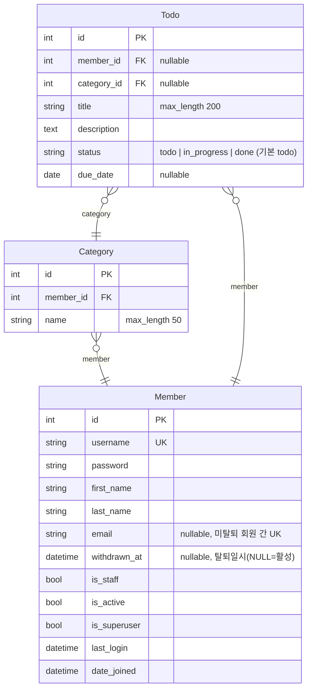

# ERD

## 제약 조건

### Member
- `unique_active_member_email` — 조건부 unique 제약(partial unique index)
  - 대상 필드: `email`
  - 조건: `withdrawn_at IS NULL` (탈퇴하지 않은 회원)
  - 탈퇴하지 않은 회원끼리만 email 중복을 막는다. 탈퇴 회원은 email을 그대로 보존하며,
    동일 email로 재가입도 가능하다.
  - `email`이 NULL인 활성 회원은 여러 명 존재할 수 있다. `Member.save()`에서 빈 문자열을
    NULL로 정규화하므로 email 미입력 회원 간 충돌이 발생하지 않는다.

### Category
- `unique_together = [member, name]` — 동일 회원 내 카테고리 이름 중복 불가
- `ordering = ["name"]`

## 참고

- `Todo.member` / `Todo.category`는 `on_delete=SET_NULL`이라 회원·카테고리 삭제 시 할일은 남고 FK만 NULL이 된다.
- `Category.member`는 `on_delete=CASCADE`라 회원 삭제 시 카테고리도 함께 삭제된다.
