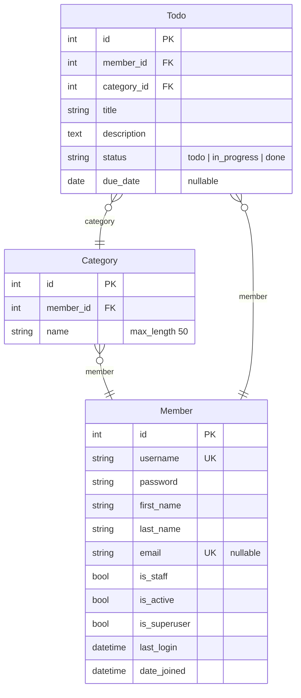

# ERD

```mermaid
erDiagram
    Member {
        int id PK
        string username UK
        string password
        string first_name
        string last_name
        string email UK "nullable"
        bool is_staff
        bool is_active
        bool is_superuser
        datetime last_login
        datetime date_joined
    }
    Category {
        int id PK
        int member_id FK
        string name "max_length 50"
    }
    Todo {
        int id PK
        int member_id FK
        int category_id FK
        string title
        text description
        string status "todo | in_progress | done"
        date due_date "nullable"
    }
    Category }o--|| Member : "member"
    Todo }o--|| Member : "member"
    Todo }o--|| Category : "category"
```
